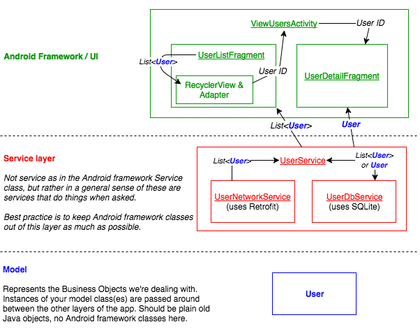

# AC_Android_Unit_5_MidUnit_Assessment

[Link to instructions and rubric](https://docs.google.com/document/d/1Oa71w_k-xJ7EHe1dQLeDNvk1_HKeEnLzBxLfwxmgXHY/)

### Notes on solution code

Please be aware that this solution code represents way, way more than anyone
could be expected to produce in 3 hours. This is intended as a reference
material, with all the bonuses included, fairly strict separation of concerns,
and tons of comments.

This solution code only utilizes Android components/libraries covered so
far in class. That means no RxJava or Dagger2 in this code, as those are
advanced concepts that would likely obscure the concepts this assessment
is testing.

Here is a diagram of how the different classes in the solution code
interact with each other. Please note that there is no single right way
to structure your code - it's OK if your code is different than this!
This is simply one option, which has some benefits and some drawbacks.
The goal is not for you to copy a particular structure, but for you to
think about structure and do what makes sense for your projects.

* [Link to instructions and rubric](https://docs.google.com/document/d/1Oa71w_k-xJ7EHe1dQLeDNvk1_HKeEnLzBxLfwxmgXHY/)

* Switch to the [solution branch](https://github.com/C4Q/AC_Android_Unit_5_MidUnit_Assessment/tree/solution) to find sample solution code

